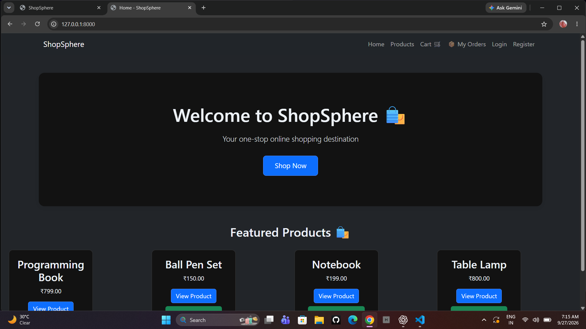
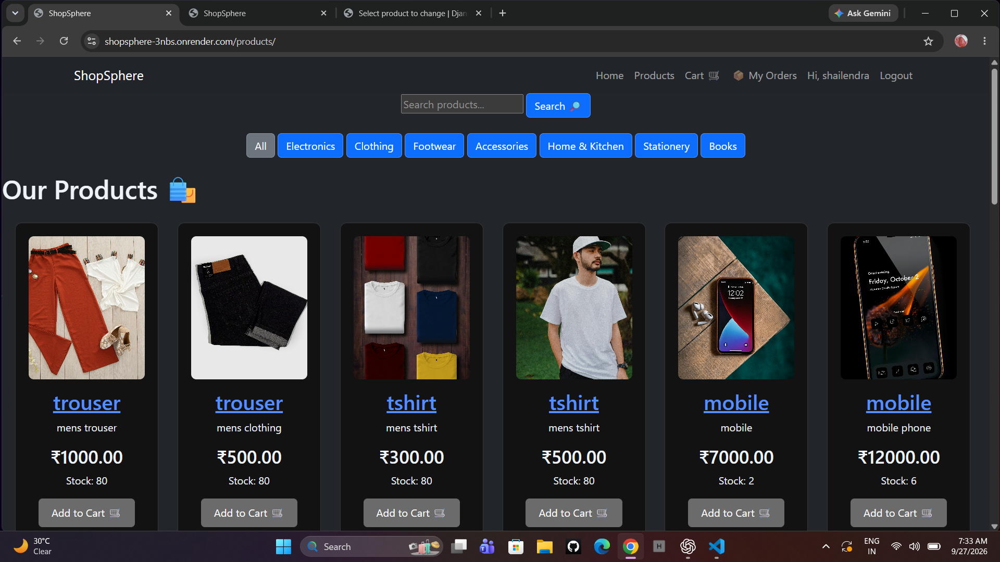
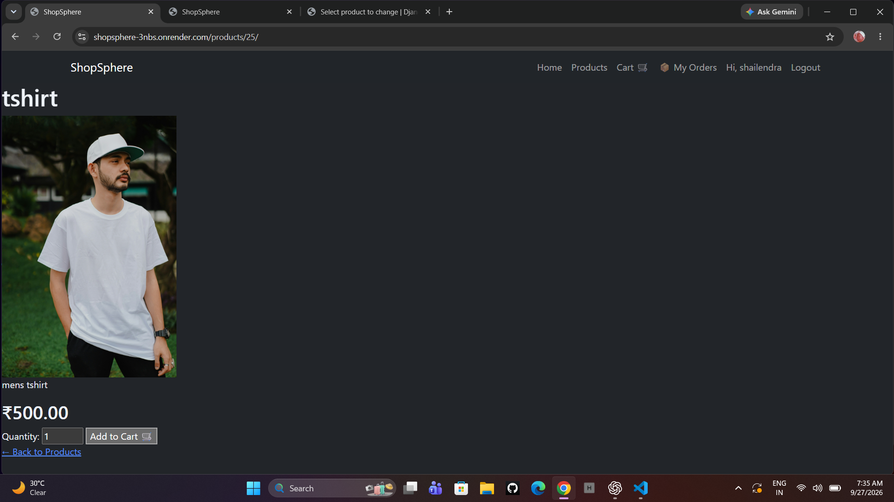
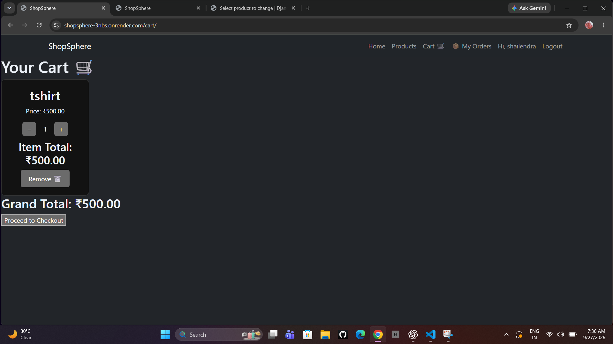
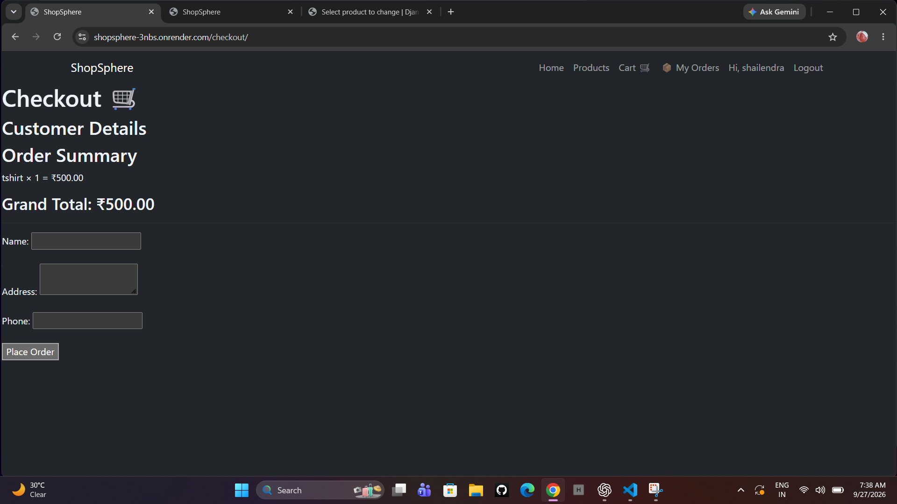
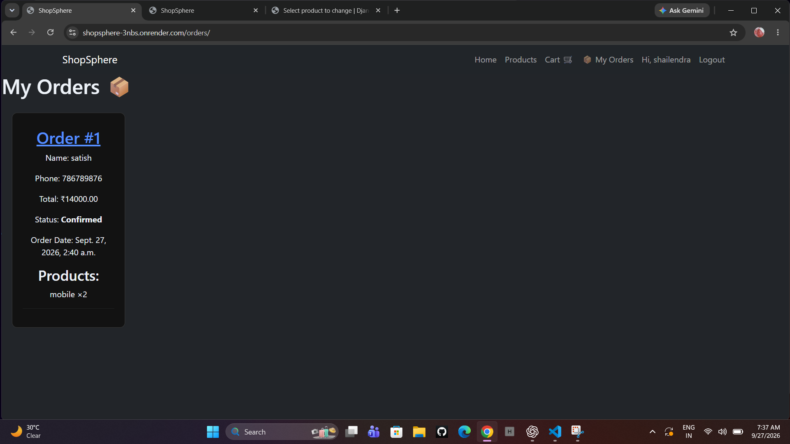
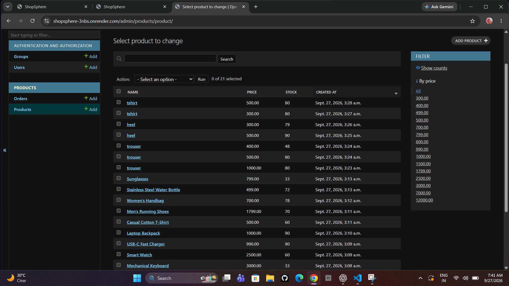

# ShopSphere 🛒

ShopSphere is a full-stack e-commerce web application built with Django.

It allows users to browse products, search and filter products, manage their cart, place orders, and track their orders.

The project also includes an admin panel for managing products, stock, and orders.
## Technologies Used

- Python
- Django
- Django REST Framework
- HTML
- CSS
- Bootstrap 5
- PostgreSQL
- Cloudinary
- Gunicorn
- WhiteNoise
- Git & GitHub
- Render
## Features

- User registration and login
- Product listing and product details
- Product search
- Category filtering
- Shopping cart
- Increase, decrease, and remove cart items
- Checkout system
- Order creation
- My Orders section
- Order details
- Order cancellation
- Order status tracking
- Product stock management
- Automatic stock reduction after placing an order
- Django admin panel
- Product and order management through admin
- Product image upload with Cloudinary
- PostgreSQL database
- Responsive design for desktop and mobile
- Production deployment on Render
## Live Demo

[ShopSphere Live Website](https://shopsphere-3nbs.onrender.com)

## GitHub Repository

[ShopSphere on GitHub](https://github.com/shailendra-sahu-creater/shopsphere.git)

## Screenshots

### Home Page


### Products Page


### Product Detail


### Cart


### Checkout


### My Orders


### Admin Panel


## Installation

### 1. Clone the repository

```bash
git clone https://github.com/shailendra-sahu-creater/shopsphere.git
cd shopsphere
```

### 2. Create a virtual environment

```bash
python -m venv venv
```

### 3. Activate the virtual environment

Windows:

```bash
venv\Scripts\activate
```

### 4. Install dependencies

```bash
pip install -r requirements.txt
```

### 5. Run migrations

```bash
python manage.py migrate
```

### 6. Start the development server

```bash
python manage.py runserver
```

Open:

```text
http://127.0.0.1:8000/
```
## Project Structure

```text
shopsphere/
│
├── ecommerce/              # Django project settings
├── products/               # Main e-commerce application
│   ├── models.py           # Product, Order and OrderItem models
│   ├── views.py            # Application views
│   ├── urls.py             # Application URLs
│   ├── admin.py            # Django admin configuration
│   └── migrations/         # Database migrations
│
├── templates/              # HTML templates
├── staticfiles/            # Collected static files
├── screenshots/            # Project screenshots
├── media/                  # Local media directory
├── manage.py               # Django management utility
├── requirements.txt        # Python dependencies
├── README.md               # Project documentation
└── .gitignore              # Git ignored files
```
## Environment Variables

Create a `.env` file in the project root directory and add the required environment variables:

```env
SECRET_KEY=your-secret-key
DEBUG=True
ALLOWED_HOSTS=127.0.0.1,localhost

CLOUDINARY_CLOUD_NAME=your-cloud-name
CLOUDINARY_API_KEY=your-api-key
CLOUDINARY_API_SECRET=your-api-secret

DATABASE_URL=your-database-url
```
Do not commit the .env file to GitHub.

## License

This project is created for educational and portfolio purposes.
